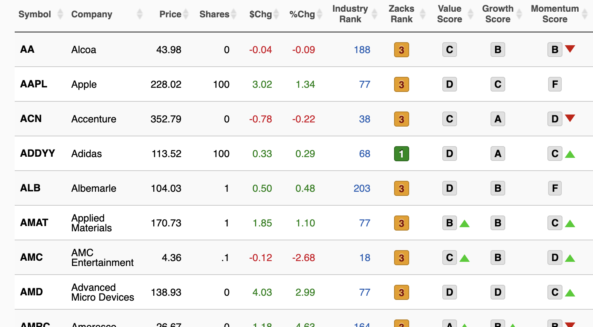
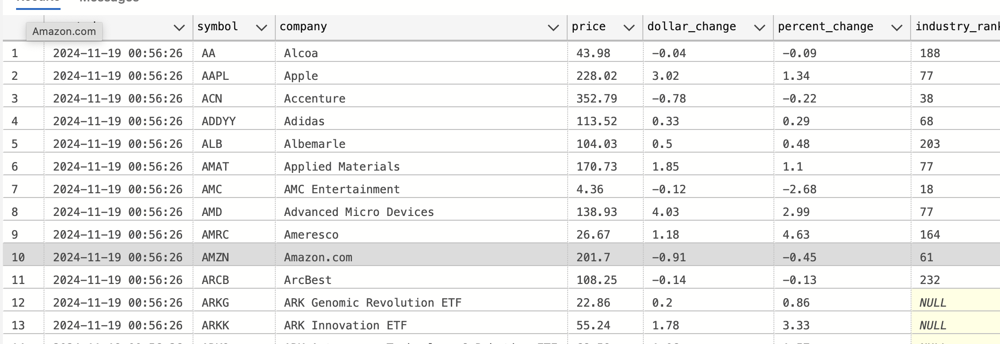
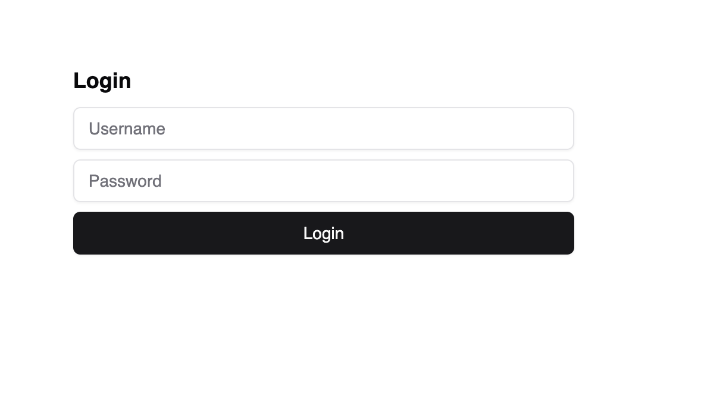
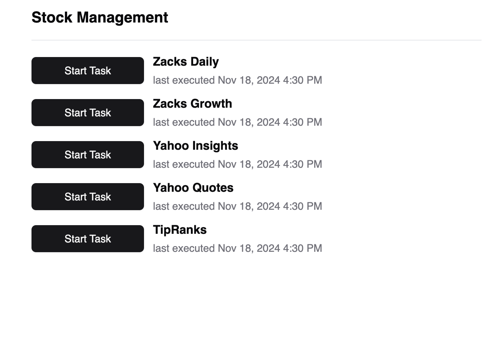
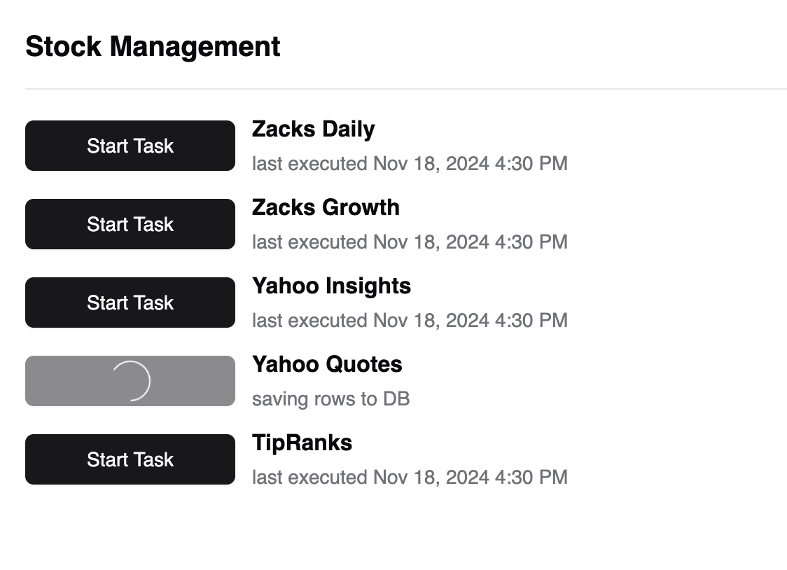

# Go Stock Management Website

## What?

This application takes data from online finance sources, like zacks.com, shown below 
reformats, and reuploads data into a relational database, chosen to be MySQL in this case for convenience reasons.


It contains a number of tasks (5 at the time of writing this) all of which
can run simultaneously. Each task can be invoked manually if an immediate
data refresh is necessary, and each invocation's status is stored to
be viewed in the task_history table. It handles conversion errors
gracefully on a row-by-row level, such that each task invocation
is guaranteed to complete, even if some of the data is partially filled in.


## Why?

My father is quite the Excel wizard, and needed stock data from
a few online sources to help manage his finances. He would go to each
of the sites that I've implemented tasks for and manually copy
them to his excel spreadsheet every day. This is fine, except that
it gets really tedious after doing it every day a few times a day.

This automates the process and also lets me practice some
programming in Go. I want to use this as an example of something that I've made
that's unit tested and helping someone, not just sitting as a half-abandoned
side project that never got completed.

## Features
### Login page
---

Uses JWT cookie authentication using Echo's JWT middleware.
Nothing special, but serves its purpose well enough.
### Task execution page
---


This is the primary reason I made this tool. It allows the authenticated user to manually trigger
an update of a given MySQL table (each task writes to its own table). Each task fetches data
from a website e.g. finance.yahoo.com, parses it and saves it into a more structured MySQL database.

The last execution, whether scheduled or manual, is shown
on this page as well (see 'last executed...'). 
### Scheduled tasks 
---
```go
c := cron.New(cron.WithLocation(must.MustLoadLocation("America/New_York")))
if _, err := c.AddFunc("0 10,14 * * MON-FRI", allTasks); err != nil {
    log.Fatalf("Error adding cron job 1: %s", err.Error())
} else if _, err := c.AddFunc("30 16 * * MON-FRI", allTasks); err != nil {
    log.Fatalf("Error adding cron job 2: %s", err.Error())
}
c.Start()
```
The tasks shown in the images are scheduled to run on a
regular cadence per the cron jobs detailed above.
